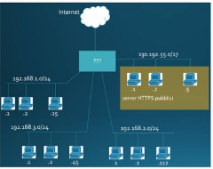

# 2023-01-27

## Domanda 1

Un client e un server del TLS 1.2 negoziano la seguente ciphersuite `TLS_DHE_RSA_WITH_3DES_EDE_CBC_SHA256`

- Spiegare cosa vuol dire ognuna delle componenti principali della ciphersuite e su quale proprietà di sicurezza e TLS ha influenza. 
- Spiegare brevemente cosa accadrà durante l’handshake protocol per lo scambio di chiavi ad autenticazione del server.
- Quale è la parte più critica di questa ciphersuite e perché?

## Domanda 2

Bob e Alice sono colleghi presso la SSI Inc. Alice invia a Bob:

- Il suo certificato X.509 a chiave pubblica firmato dalla CA aziendale;
- Un file firmato con la chiave privata corrispondente alla pubblica presente nel certificato.

Assumete che la SSI Inc sia dotata di una infrastruttura a chiave pubblica completa, gestita correttamente sia al livello di registrazione che di funzionalità informatica. Riportare tutti i passi che Bob deve fare (o un tool al suo posto) per poter stabilire che la firma sia valida.

Possibile risposta

> Risposta di uno studente non validata

1. Bob riceve il certificato X.509 di Alice e la firma digitale.
2. Bob verifica il certificato di Alice:
   - Controlla che il certificato sia valido e che non sia revocato.
   - Verifica che la firma sul certificato di Alice provenga da una CA affidabile.
3. Bob verifica la firma digitale:
   - Decifra la firma usando la chiave pubblica di Alice.
   - Confronta l'hash calcolato con l'hash estratto dalla firma per verificare l'integrità del file.

Se il certificato è valido e la firma corrisponde, Bob può essere sicuro che il file non è stato alterato e che proviene da Alice.

## Domanda 3

Riportare 4 aspetti relativi all’implementazione di servizi che rispettino Privacy by design secondo il GDPR e una breve spiegazione. Spiegare chi è e che ruolo ha il DPO.

## Domanda 4

Spiegare come funziona l’autenticazione basata sulle password ripetibili. Riportare i principali problemi che bisogna affrontare lato client, lato server, nel canale di comunicazione e quelle generali e le conseguenti mitigazioni.

## Domanda 5

Indicare quali delle seguenti affermazioni sul SYN Interceptor e SYN Monitor sono vere (più di una). Attenzione: risposte sbagliate danno punteggi negativi.

a. Il SYN Interceptor è meno efficace del SYN Monitor;
b. Il SYN Monitor è meno efficace del SYN Interceptor;
c. Non alterano il three-way handshake ma inviano pacchetti al posto del server:
d. Cambiano il three-way handshake per evitare SYN flooding inviando l’hash del sequence number;
e. Il SYN Interceptor risponde al posto del server. Contatta il server stabilendo una connessione solo se il three-way handshake ha successo;
f. Servono entrambi a mitigare gli attacchi di tipo SYN flooding;
g. Il SYN Monitor risponde al posto del server. Contatta il server stabilendo una connessione solo se il three-way handshake ha successo;
h. Nessuno dei due risolve completamente il problema del SYN flooding.

## Domanda 6

6. Un’azienda ha una rete organizzata come riportata sotto:

 
E vuole implementare la seguente politica di sicurezza:

- A. Nessuna restrizione interna ad ognuna delle 3 sottoreti
- B. Il server interno 192.168.1.1 deve essere raggiungibili dalle sottoreti .2 e .3
- C. Il server interno 192.168.2.3 deve essere raggiungibile dalla sottorete .1
- D. Nessuna sottorete interna (.1*, .2*, .3*) deve essere raggiungibile dall’esterno;
- E. Tutti gli host interni alle sottoreti .1 e .2 possono raggiungere Internet
- F. Tutti gli host interni alle sottoreti .3 non possono raggiungere Internet
- G. I server con indirizzi pubblici devono essere raggiungibili da Internet ma solo su un insieme di URL note (immaginate siano salvate su un file come $ur1, $url2, …)

Indicate quali controlli di sicurezza preventiva abilitereste sull’elemento al bordo (contrassegnato con ???) per implementare i requisiti e quale architettura state applicando. Riportate inoltre le regole corrispondenti (può essere pseudo-linguaggio di configurazione ma deve riportare tutti i campi essenziali necessari).
