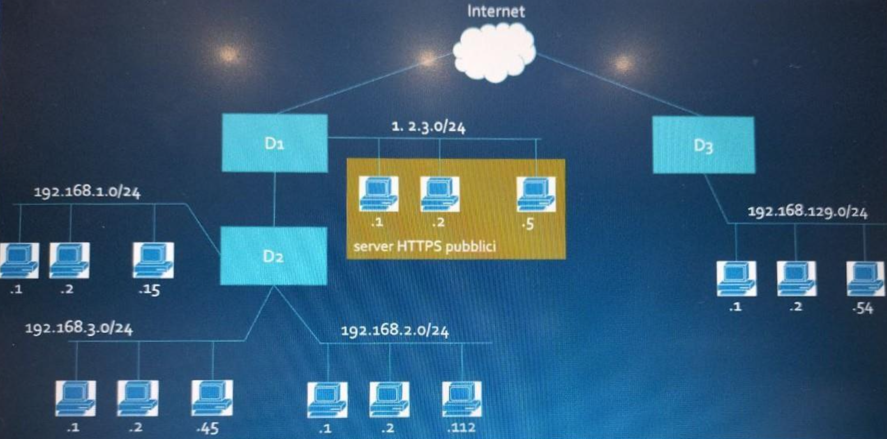

# 2024 - Gennaio

## Domanda 1

- un IPS può permettere di velocizzare ed automatizzare la risposta alle intrusioni rilevate  
- un HIDS può verificare che alcuni file non vengano modificati e analizzare quello che riportano i log 
dei sistemi informativi  
- un SOC dovrebbe includere anche personale che si occupa dell'analisi del cybercrime per 
mantenere aggiornata l'analisi dei rischi  
- dal punto di vista delle intrusioni, osservare quello che avviene all'esterno della mia organizzazione 
non è particolarmente rilevante .
- le persone che lavorano in un SOC non dovrebbero occuparsi di vulnerability management e patch management 
- preparare le politiche di risposta agli incidenti è possibile solo se un'azienda ha un Incident Response Team 
- un SIEM (System Information Events Management) combina le funzionalità di analisi degli eventi e per la gestione di un sistema informativo 
- un NIDS è uno scanner di rete che identifica vulnerabilità note
- gli honey pot sono strumenti che servono ad attirare gli attaccanti simulando il fatto che le risorse siano più facili da attaccare per aumentare il loro interesse

## Domanda 2

- I dati relativi allo stato di salute e la razza sono considerati di categoria speciale  
- Il Titolare del trattamento dei dati del Politecnico di Torino è il rettore  
- Nel GDPR, il principio della privacy by design indica che bisogna usare automaticamente le 
protezioni più restrittive possibili -> possibile che la invalidi 
- Quando una persona accetta il ruolo di DPO diventa responsabile dei danni causati dai data breach  
- Un data breach è un incidente informatico che porti alla distruzione, alterazione, diffusione non 
autorizzata o accesso ai dati personali  
- Il GDPR introduce il concetto di minimizzazione, che indica che i dati devono essere collezionati 
usando il minimo numero di strumenti e resi accessibili al minor numero di operatori 
- Il DPO si occupa di riottenere i dati degli utenti quando avvengono dei data breach  
-Il principio della Full Functionality del GDPR richiede che i controlli funzionino al massimo livello di 
sicurezza per garantire la protezione dei dati personali 
- I servizi che usano dati personali devono essere pensati per proteggere questi dati durante tutte le 
fasi di progettazione ma non si può garantire che lo siano anche durante implementazione 

## Domanda 3 

- Per avere una Qualified Electronic Signature la chiave pubblica deve provenire da un Qualified 
Certificate 
- Se un documento è firmato da più persone usando firme parallele, è possibile rimuovere una firma 
senza che gli altri firmatari se ne accorgano 
-Cambiando l'ordine di una delle firme sequenziali può far fallire la verifica di qualche firma digitale 
- Il Time Stamp è, in pratica, la firma digitale di una stringa di testo o di un intero che rappresenti un 
valore temporale e del digest di un documento 
- Un esempio di enveloped signature è quella usata dal PKCS#7 
- Un dispositivo di firma sicuro può essere ritenuto sicuro se è tamper proof e usa algoritmi ritenuti 
sicuri 
- Forgiare una firma falsa è più facile se si usano le detached signature 
- L'Advanced Electronic Signature può essere usata in tribunale 
- Un Qualified Certificate certifica l'identità usando algoritmi qualificati, riconosciuti dalle entità come 
più efficaci

### Domanda 4

- Il Mandatory Access Control funziona confrontando le etichette (label) delle risorse e degli utenti che 
ne fanno richiesta e concedono l'accesso secondo modelli formali. 
- L'orange book è documento redatto dal DoD il cui titotlo completo è Trusted Computer System 
Evaluation Criteria. 
- I Common Criteria non fanno riferimento ad un processo di valutazione perché questa è trattata dalla 
Computer Evaluation Methodology. 
- Gli standard possono permettere di stimare quando alcuni prodotti di sicurezza possono essere 
considerati sicuri senza fare test propri 
 Una strength of mechanisms dichiarata alta indica che il prodotto può ritenersi molto sicuro. 
- In Italia non abbiamo un Common Criteria Evalutaion Scheme, perché la certificazione CC funziona 
solo a livello europeo 
- In una valutazione di sicurezza ai fini della standardizzazione, la correttezza della soluzione non deve 
tener conto del processo di sviluppo. 
- Un Protection Profile è un modo per definire in maniera semplificata come verrà gestita la procedura 
di valutazione per security target specifici 
- ITSEC non supporta la ri-valutazione di un precedente processo di standardizzazione

### Domanda 5

- S/MIME usa il meccanismo standard di MIME per gestire gli allegati per inserire oggetti crittografici 
- HTTP-S è un'implementazione obsoleta che protegge messaggi HTTP usando strutture S/MIME 
- la firma digitale di S/MIMEV4 ha sempre valore legale perché dalla versione 4 è uno standard IETF e 
usa crittografia asimmetrica che permette il non ripudio 
- il formato PKCS#12 è un metodo ottimizzato per trasportare firme digitali 
- il greylisting è uno strumento molto efficace per decidere se rifiutare o accettare mail da un MTA 
Open Relay 
- i messaggi clear-signed sono visibili su qualunque strumento per la gestione delle mail e anche da 
web perché firmati con firma detached 
- il CMS è l'evoluzione del formato PKCS#12 per la rappresentazione di dati crittografici 
- il metodo STARTLS è usato per trasmettere in maniera confidenziale messagi di posta elettronica 
- un server Open Relay permette di inviare mail senza restrizioni ai soli utenti interni 
- il protocollo SMTP permette di autenticare gli utenti prime di inviare mail solo con metodi deboli 
come LOGIN, PLAIN CRAM-MD5 

### Domanda 6

Spiegare come funziona il metodo di autenticazione TOTP, indicando esplicitamente 
quali dati vengono usati dai client. Quali vengono inviati e quali verifiche vengono svolte 
dai server. 
Indicare i principali tipi di attacco che si possono eseguire lato client, server e  nel 
canale di comunicazione. 
Nel modello NIST SP8000-63B, come dovrebbero essere definiti il ruolo del client e 
server durante l’autenticazione?

## Domanda 7

Spiegare cosa è l’algoritmo RSA, quali sono i parametri pubblici e privati, quale è il problema matematico su cui si fonda la sua sicurezza.
Indicare delle ottimizzazioni computazionali e discutere alcune debolezze note.
Indicare quale è il numero di bit di una chiave RSA che possa essere considerato sicuro nel 2024.
Infine, spiegare in quali fasi del TLS e di IPsec/IKE può essere usato e a quale fine

## Domanda 8

Data l’architettura di rete in figura:

 
Ed i seguenti requisiti:

1. Nessuna restrizione interna alle sottoreti 
2. Nessuna rete interna (.1 / .2 / .3 /.129) deve essere raggiungibile dall’esterno
3. Gli host della sottorete .1 devono essere raggiungibili dalle sottoreti .2 e .3
4. Gli host della sottorete .2 devono essere raggiungibili dalle sottoreti .1 e .3
5. Gli host della sottorete .3 devono essere raggiungibili dalla sola sottorete .2
6. Tutti gli host interni delle sottoreti .1 .2 .3 .129 possono raggiungere internet solo dopo essersi autenticati 
7. I server pubblici devono essere raggiungibili da Internet solo su URL fisse note a priori
8. Il payload dei pacchetti http che arrivano ai server HTTPs devono essere ispezionati perché non contengano tipi di file potenzialmente pericolosi
9. I server pubblici devono essere protetti da attacchi standard
10. La sottorete .2 deve comunicare in maniera sicura con la sottorete .129, il traffico deve restare confidenziale rispetto agli utenti esterni

Indicare quali funzioni di sicurezza si dovrebbero abilitare nei dispositivi D1, D2, D3 per implementare correttamente tutti i requisiti. Notare che non è obbligatorio scegliere almeno una funzione per ognuno dei dispositivi e che in ogni dispositivo possono essere usate più funzioni.  
Ogni decisione deve essere motivata e per ogni dispositivo devono essere associati i requisiti che permette di soddisfare.

Infine, scrivere le regole per implementare i requisiti 3) 4) e 5) in uno pseudo linguaggio di configurazione a scelta indicando esplicitamente la politica di default.
