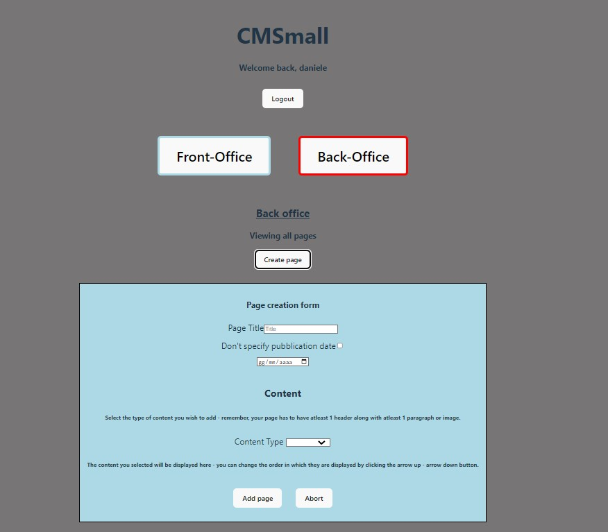
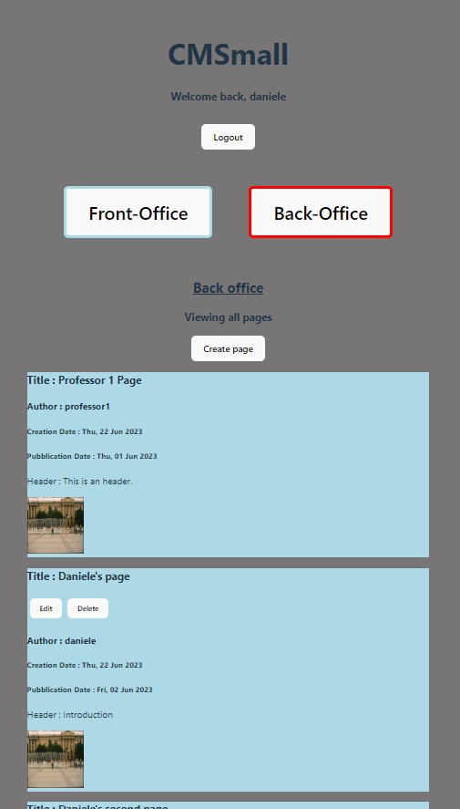

# Exam #1: "CMSmall"
## Student: s319508 NOVARESE DANIELE 

## API Server
Functionalities to implement: 
-`GET` Retrieve all pages (logged-in users only)  
-`GET` Retrieve published pages (non-logged in users & logged-in)  
-`POST` Create page (logged-in users)  
-`PUT` Edit page (logged-in users, only own page for normal users any page for admins)   
-`DELETE`  Delete page (logged-in users, only own page for normal users - any page for admins)  
-`PUT` Change website name (admin only)  
-`POST`Login  
-`POST`Logout  

# RETRIEVE ALL PAGES
- GET `/api/pages`
  - Request parameters > {}
  - Request body > {}
  - Succesful response > status 200 >
     ## Response body 
        {
          data : 
          [
            {
              "id": "int",
              "title":"text",
              "author":"text",
              "creation_date":"text",
              "pubblication_date":"text",
              "content": [
                {
                  "type":"text",
                  "content":"text",
                },
                ...
              ]
          },
          ...
          ]
        }
    - Unsuccesful response > 
    - status 500 (server error)
    - status 403 (forbidden)
     ## Response body 
        {
          "error"  : "error description"
        }

# RETRIEVE ONLY PUBLISHED PAGES
- GET `/api/published-pages`
  - Request parameters > {}
  - Request body > {}
  - Succesful response > status 200 >
      ## Response body 
            {
              data : 
              [
                {
                  "id": "int",
                  "title":"text",
                  "author":"text",
                  "creation_date":"text",
                  "pubblication_date":"text",
                  "content": [
                    {
                      "type":"text",
                      "content":"text",
                    },
                    ...
                  ]
              },
              ...
              ]
            }
   - Unsuccesful response > status 500 >
       ## Response body 
            {
              "error"  : "error description"
            }
    
# CREATE NEW PAGE
- POST `/api/pages`
  - Request parameters > {}
  - Request body > JSON formatted object
    ## Request body
          {
            "title" : "text",
            "author": "text",
            "pubblication_date" : "text",
            "content": [
                  {
                    "type":"text",
                    "content":"text",
                  },
                  ...
                ]
          }
  - Succesful response > status 200
    ## Response body 
        {
          "message"  : "Succesful creation."
        }
  - Unsuccesful response > 
      - status 500 (internal server error)
      - status 422 (validation error, wrong input data)
      - status 403 (forbidden)
      ## Response body 
            {
              "error"  : "error description"
            }
- 

# UPDATE EXISTING PAGE
- PUT `/api/pages/:id`
  - Request parameters >
   ## Request params
        {
          "id" : "int"
        }
  - Request body > JSON formatted object
  ## Request body
        {
          "title" : "text",
          "author": "text",
          "creation_date" : "text",
          "pubblication_date" : "text",
          "content": [
                {
                  "type":"text",
                  "content":"text",
                },
                ...
              ]
        }
  - Succesful response > status 200
  ## Response body 
        {
          "message"  : "Succesful update."
        }
  - Unsuccesful response > 
      - status 500 (internal server error)
      - status 422 (validation error, wrong input data)
      - status 404 (item doesn't exist)
      - stauts 403 (forbidden)
  ## Response body 
        {
          "error"  : "error description"
        }

      
# DELETE PAGE
- DELETE `/api/pages/:id`
  - Request parameters > 
    ## Request params
        {
          "id" : "int"
        }
  - Request body > []
  - Succesful response > status 200
   ## Response body 
        {
          "message"  : "Succesful delete."
        }
  - Unsuccesful response > 
      - status 500 (internal server error)
      - status 404 (item doesn't exist)
      - status 403 (forbidden)
    ## Response body 
        {
          "error"  : "error description"
        }

# CHANGE WEBSITE NAME
- PUT `/api/config`
  - Request parameters > []
  - Request body > JSON formatted object
   ## Request body
        {
          "website_name" : "text"
        }
  - Succesful response > status 200
  ## Response body 
        {
          "message"  : "Succesfully changed website title."
        }
  - Unsuccesful response > 
      - status 500 (internal server error)
      - status 422 (validation error, wrong input data)
      - status 403 (forbidden)
    ## Response body 
        {
          "error"  : "error description"
        }
# LOGIN
- POST `/api/login`
  - Request parameters > []
  - Request body > JSON formatted object
   ## Request body
        {
          "username" : "text",
          "password" : "text"
        }
  - Succesful response > status 200
  - Unsuccesful response > 
      - status 500 (internal server error)
      - status 403 (forbidden)
# LOGOUT
- POST `/api/login`
  - Request parameters > []
  - Request body > []
  - Succesful response > status 200

# GET WEBSITE NAME
- GET `/api/website_name`
  - Request parameters > []
  - Request body > []
  - Succesful response > status 200
   ## Response body 
        {
          "data"  : {
            name : "website name"
          }
        }
      
  - Unsuccesful response > 
  - status 500 (internal server error)
  ## Response body 
        {
          "error"  : "error description"
        }
 

## Database Tables

All fields except for the "id" contain data of type text.
IDs are of type integer.

- Table `users` 
  - id
  - username
  - password (*hashed*)
  - salt
  - role

- Table `pages`
  - id
  - title
  - author
  - creation_date
  - pubblication_date
  - content 

- Table `configurations`
  - id
  - website_name

## React Routes
- `/` : Refers to the index page - contains the Layout component
  - `Home`: Refers to the Homepage - contains the Homepage  component (brief introduction) 
  - `FrontOffice`: Refers to the front office - contains the Front_Office component 
  - `BackOffice`: Refers to the back office - contains the Back_Office component 
Any other route redirects to the Notfound component. 

## Main React Components
- `Layout` (in `../routes/Layout.jsx`): main Layout component - contains the navigation bar + the outlet for the current route (front office, back office, home) 
- `Homepage` (in `../routes/Homepage.jsx`): contains the Homepage component, which offers a brief introduction to the website. 
- `Back_Office` (in `Back_Office.jsx`): component containing the entire back office: retrieves all the pages after checking if the user is logged in and displays them. 
- `Front_Office` (in `Front_Office.jsx`): component containing the entire front office: retrieves all published pages and displays them. Available to logged in and not logged in users. 
- `Navbar_c.jsx` (in `Navbar_c.js`): component containing the main navigation bar, which remains persistent throughout all the website. Contains the login / logout buttons + modify website button (Admin only). 
- `Single_page` (in `Page_component.jsx`): component containing a single page item of the website - this page will contain a title, author, creation date, pubblication date and a list of contents. 
- `Page_form` (in `Page_form.jsx`) : component containing the form for creating a single page - it is used inside of the back_office to create a new page. 

## Screenshot
Please keep in mind that the images are visualizing the website with a zoom factor of 65% (instead of regular 100%) 
`Creating a new page`

`All pages` 

## Users Credentials

### NORMAL USERS
- username : `daniele`, password : `daniele` > 2 published pages
- username : `federica`, password : `federica` > no pages
### ADMINS
- username : `professor1`, password : `professor1` > 2 published pages, 2 drafted pages, 2 programmed pages
- username : `professorx`, password : `professorx` > no pages
