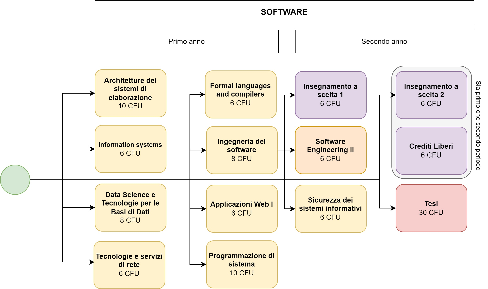

# Magistrale

## Orientamenti

Di seguito sono riportati gli orientamenti per la magistrale in Computer Engineering presso il Politecnico di Torino.

### Software

 <!-- .element height="25%" width="25%" -->

## Voto Finale

La determinazione del voto finale è assegnata alla commissione di laurea che prenderà in esame la media complessiva degli esami su base 110.

A tale media la commissione potrà sommare, di norma, sino ad un massimo di 8 punti prendendo in considerazione:

- la valutazione del lavoro svolto per la tesi (impegno, autonomia, rigore metodologico, rilevanza dei risultati raggiunti etc.);
- la presentazione della tesi (chiarezza espositiva etc.);
- l'eccellenza del percorso di studi (ad esempio, il numero delle lodi conseguite, il tempo impiegato per terminare gli studi etc.).

La lode potrà essere assegnata al raggiungimento del punteggio complessivo 112,51 a discrezione della commissione.

Se la tesi ha le caratteristiche necessarie, può essere concessa la dignità di stampa soltanto qualora il voto finale sia centodieci e lode e il parere della commissione sia unanime.
